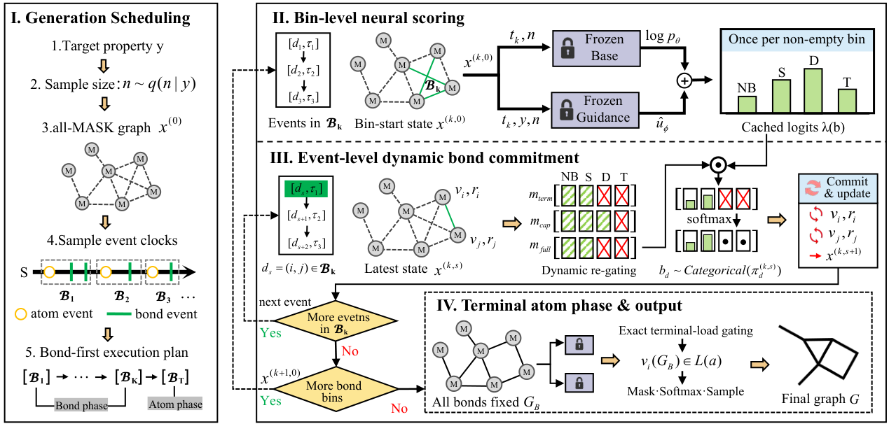

# VaDGM: Valence-Aware Discrete Guidance Matching for Property-Targeted Molecular Graph Generation

[](https://www.python.org/downloads/release/python-3110/)
[](https://pytorch.org/)
[](https://2027.ieeeicassp.org/)
[](LICENSE)

Official PyTorch implementation of the paper **"VaDGM: Valence-Aware Discrete Guidance Matching for Property-Targeted Molecular Graph Generation"** (IEEE ICASSP 2027).

---

## Overview

Discrete flow matching and diffusion models provide powerful frameworks for property-guided molecular generation. However, accelerated sampling in finite hazard-time bins faces a fundamental chemical bottleneck: **finite-bin joint-conflict**. Proposals within a single bin concurrently compete for shared atomic valence capacities, frequently causing oversubscription and radical defects.



**VaDGM** reconciles accelerated discrete guidance matching with physical valence invariants:
1. **Dynamic Sequential Re-gating**: Caches network logits across the hazard bin and dynamically updates lightweight valence gates sequentially, ensuring strict mathematical path-capacity safety without additional neural network evaluations.
2. **Terminal Reachability & Atom Phase Deferral**: Defers heavy atom selection to a terminal phase after bond topology crystallizes, eliminating under-valent radicals and ensuring complete valence fulfillment.
3. **Tri-fold Win**: On ZINC250K, VaDGM eliminates all capacity violations (**0.00%**), achieves **99.97%** radical-free completeness, and boosts Strict Valid Target-Hit Rate by **53.6%** with **84.3% fewer neural evaluations** (NFE = 20.12 vs. 128.00).

---

## Repository Structure

```text
VaDGM/
├── assets/                          # Architectural overview & diagrams
├── configs/                         # Model architectures and sampling configurations
│   ├── base.yaml                    # Base absorbing-state discrete diffusion model
│   ├── guidance.yaml                # DGM property guidance head (Q80 logP)
│   ├── sampling.yaml                # Default VaDGM sampling (Δs=0.25)
│   └── experiments/                 # Paper experiment configs (Table 1, Table 2, Table 3)
├── data/                            # 32-token chemical vocabulary & sample manifests
│   └── processed/zinc100k_v1/       # Standardized ZINC250K subset metadata & vocabulary
├── results/                         # Paper source data for instant verification
│   └── paper/source_data/           # Exact metrics from 120,000 generated outputs across 3 seeds
├── scripts/                         # One-click paper reproduction suite
│   ├── quickstart.py                # 1-minute chemical engine and codec validation
│   ├── reproduce_table1.py          # Main comparison (Table 1)
│   ├── reproduce_table2.py          # Component ablation study (Table 2)
│   ├── reproduce_table3.py          # Hazard bin-width sensitivity (Table 3)
│   ├── plot_figures.py              # Visualizing property curves & sensitivity
│   └── download_checkpoints.py      # Automated download for pre-trained weights
├── tests/                           # Comprehensive test suite (84 unit & e2e tests)
├── vadgm/                           # Core Python library
│   ├── chemistry.py                 # GraphCodec, AtomVocabulary, CapacityEngine
│   ├── models/                      # Discrete graph networks & guidance heads
│   ├── sampler.py                   # Valence-aware dynamic sequential re-gating sampler
│   └── evaluation.py                # RDKit validation, radical counting, Strict VTHR
├── pyproject.toml                   # Packaging and dependency declarations
├── requirements.txt                 # Pip dependency definitions
└── environment.yml                  # Conda environment definition
```

---

## Installation

### Option A: Using `uv` (Recommended for High Speed)

```bash
# Clone the repository
git clone https://github.com/xbtc-lab/VaDGM.git
cd VaDGM

# Install dependencies using uv
uv pip install -e .
```

### Option B: Using `conda` & `pip`

```bash
# Create and activate environment
conda env create -f environment.yml
conda activate vadgm

# Install package in editable mode
pip install -e .
```

---

## 1-Minute Quick Start

Verify the environment, 32-token vocabulary, and capacity safety validation in seconds:

```bash
python scripts/quickstart.py
```

---

## One-Click Paper Reproduction Suite

All tables and figures in the paper are backed by reproducible source data (`results/paper/source_data/`) from 120,000 Monte Carlo sampling outputs evaluated across three random seeds (2027, 2028, 2029).

### Reproduce Table 1: Main Comparison across Methods
Inspect the tri-fold win: zero capacity violations, 99.97% radical-free rate, and +53.6% Strict VTHR:
```bash
python scripts/reproduce_table1.py
```

### Reproduce Table 2: Component Ablation Study
Inspect the sequential progression across Vanilla $\to$ C $\to$ C+R $\to$ C+R+A:
```bash
python scripts/reproduce_table2.py
```

### Reproduce Table 3: Bin-Width Sensitivity ($\Delta s$)
Inspect sampling efficiency versus target hit rates from $\Delta s = 0.50$ down to $0.0625$:
```bash
python scripts/reproduce_table3.py
```

### Reproduce Paper Figures
Generate publication-quality figures:
```bash
python scripts/plot_figures.py
```

---

## Running Full Guided Sampling

To sample new molecules from pre-trained weights:

1. **Download Pre-trained Checkpoints**:
   ```bash
   python scripts/download_checkpoints.py
   ```
   Or place pre-trained weights into `artifacts/base/best.pt` and `artifacts/guidance/logp_q80_best.pt`.

2. **Execute Accelerated VaDGM Sampling**:
   ```bash
   python -m vadgm.cli sample-guided \
     --base-config configs/base.yaml \
     --base-checkpoint artifacts/base/best.pt \
     --guidance-config configs/guidance.yaml \
     --guidance-checkpoint artifacts/guidance/logp_q80_best.pt \
     --sampler-config configs/sampling.yaml \
     --vocabulary data/processed/zinc100k_v1/atom_vocabulary.json \
     --output results/samples/vadgm_q80.json \
     --n-samples 1000 \
     --condition q80 \
     --delta-s 0.25 \
     --device cuda
   ```

3. **Evaluate Generated Outputs**:
   ```bash
   python -m vadgm.cli evaluate \
     --input results/samples/vadgm_q80.json \
     --vocabulary data/processed/zinc100k_v1/atom_vocabulary.json \
     --target-logp 3.349 \
     --output results/samples/vadgm_q80_metrics.json
   ```

---

## Unit Testing

The repository includes a comprehensive test suite covering molecular graph codecs, capacity invariants, hazard-bin schedulers, and property evaluations:

```bash
pytest -q
```
*(All 84 tests pass cleanly)*.

---

## Citation

If you find VaDGM useful in your research, please cite our paper:

```bibtex
@inproceedings{xiong2027vadgm,
  author    = {Bin Xiong and Xingjie Zeng and Cheng Zhong and Xi Cheng and Cheng Shi and Hans-Arno Jacobsen},
  title     = {{VaDGM}: Valence-Aware Discrete Guidance Matching for Property-Targeted Molecular Graph Generation},
  booktitle = {Proc. IEEE Int. Conf. Acoust., Speech Signal Process. (ICASSP)},
  year      = {2027},
  pages     = {1--5}
}
```

---

## License

This project is licensed under the MIT License. See [LICENSE](LICENSE) for details.
